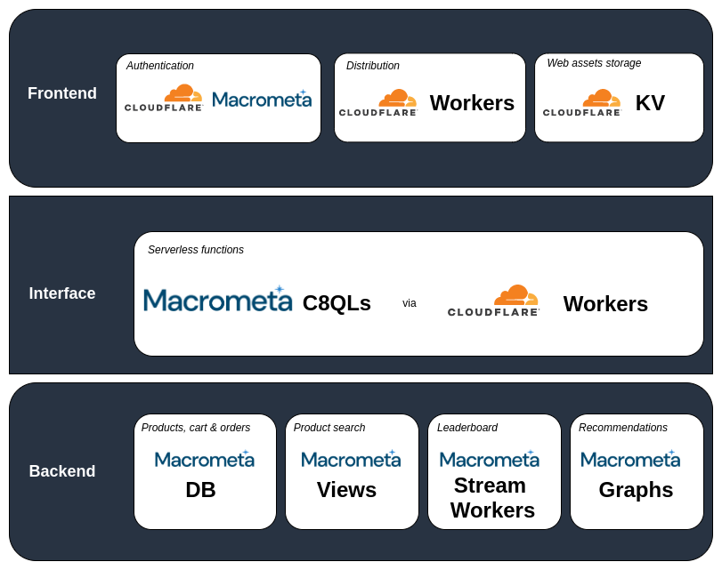
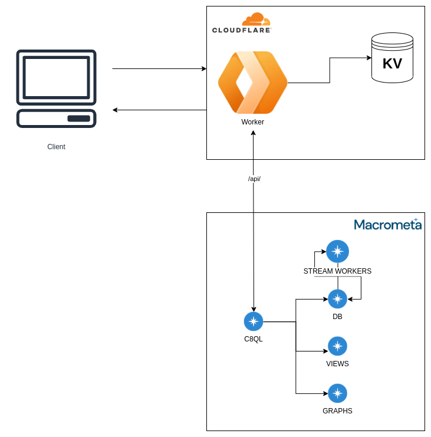
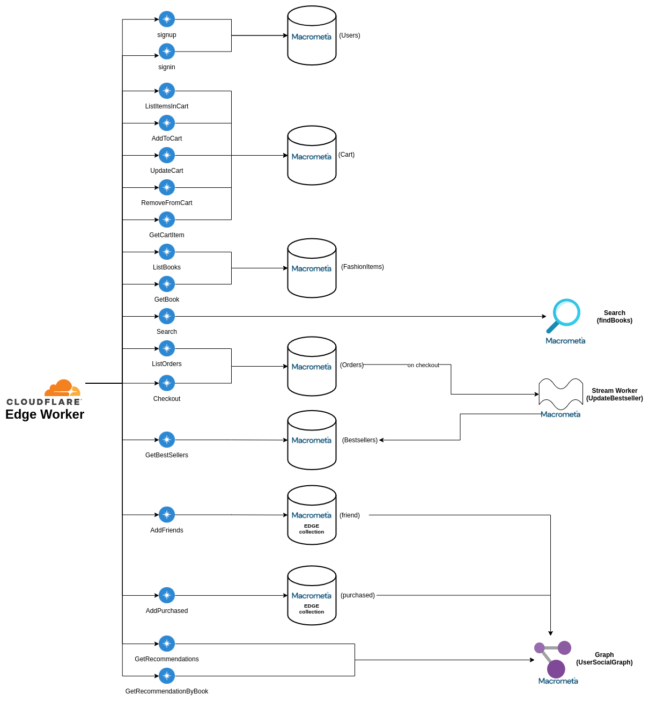

# Macrometa CloudFlare e-commerce template app

**Live Demo: https://bookstore.macrometadev.workers.dev/**

Macrometa-Cloudflare Bookstore Demo App is a full-stack e-commerce web application that creates a storefront (and backend) for customers to shop for "fictitious" books.


Originally based on the AWS bookstore template app (https://github.com/aws-samples/aws-bookstore-demo-app), this demo replaces all AWS services like below

- AWS DynamoDB,
- AWS Neptune (Graphs),
- AWS ElasticSearch (Search),
- AWS Lambda
- AWS Kinesis

This demo uses Macrometa's geo distributed data platform which provides a `K/V store`, `DynamoDB compatible document database`, `graph database`, `streams` and `stream processing` along with Cloudflare `edgeworkers` for the globally distributed functions as a service.

Unlike typical cloud platforms like AWS, where the backend stack runs in a single region, Macrometa and Cloudflare let you build `stateful distributed microservices that run in 100s of regions around the world concurrently`. The application logic runs in cloudflare's low latency function as a service runtime on cloudflare PoPs and make stateful data requests to the closest Macrometa region. End to end latency for `P90 is < 55ms` from almost everywhere in the world.

As a user of the demo, you can browse and search for books, look at recommendations and best sellers, manage your cart, checkout, view your orders, and more.

## GDN Tenant Account

| **Federation**                                        | **Email**              | **Passsword** |
| ----------------------------------------------------- | ---------------------- | ------------- |
| [Global Data Network](https://gdn.paas.macrometa.io/) | bookstore@macrometa.io | `xxxxxxxx`    |

## Architecture



## Data & Control Flows



## Details

### Frontend

- Frontend is a Reactjs application which is hosted using Cloudflare.
- Web assets are stored on Cloudflare's KV store.

### Backend

The core of backend infrastructure consists of Macrometa Document store(DB), Macrometa Edge store(DB), Macrometa Views(search), Macrometa Stream Workers, Macrometa Graphs and Cloudflare workers. Cloudflare workers issue C8QLs to talk with the GDN network.

The application leverages Macrometa GDN document store to store all the data for books, orders, the checkout cart and users. When new purchases or new users are added the corresponding Macrometa Edge collection is also updated. These Edge collections along with Document collection acting as vertices are used by the Macrometa Graphs to generate recommendations for the users. When new purchases are added Macrometa Stream Workers also update the BestSellers Collection store in realtime from which the best sellers leaderboard is generated.



**Catalog, Cart, Orders:**

This is implemented using `document collections` functionality in Macrometa GDN

| Entity  | Collection Name | Collection Type | Comment                                    |
| ------- | --------------- | --------------- | ------------------------------------------ |
| Catalog | BooksTable      | document        | Collection of the available books.         |
| Cart    | CartTable       | document        | Books customers have addded in their cart. |
| Orders  | OrdersTable     | document        | Past orders of a customer.                 |

**Recommendations:**

This is implemented using `graphs` functionality in Macrometa GDN. Each node in the graph is a `vertex` and the links connecting the nodes are `edges`. Both `vertex` and `edges` are document collections. The `edges` require two additional mandatory indexes i.e., `_from` and `_to`.

| Entity   | Collection Name | Collection Type | Comment                                      |
| -------- | --------------- | --------------- | -------------------------------------------- |
| Friends  | Friend          | edge            | Edge collection to capture friend relations. |
| Purchase | Purchased       | edge            | Edge collection to capture purchases.        |
| Users    | UserTable       | vertex          | Document collection of available users.      |
| Catalog  | BooksTable      | vertex          | Collection of the available books.           |
| Social   | UserSocialGraph | graph           | User social graph                            |

**Search:**

Search is implemented using `views` functionality in Macrometa GDN. Search matches on the `category` or the `name` of book in `BooksTable` with phrase matching.

| Entity | Collection Name | Collection Type | Comment                               |
| ------ | --------------- | --------------- | ------------------------------------- |
| Find   | findBooks       | view            | The view which is queried for search. |

**Top Sellers List:**

This is implemented using `streams` and `stream processing` functionality in Macrometa.

| Entity     | Name             | Type          | Comment                                                              |
| ---------- | ---------------- | ------------- | -------------------------------------------------------------------- |
| BestSeller | UpdateBestseller | stream worker | Stream worker to process orders and update best sellers in realtime. |
| BestSeller | BestsellersTable | document      | Collection to store best sellers.                                    |

**Indexes:**

Create persistent indexes on the collection for the corresponding attributes

| **Collection**   | **Attribute**                        |
| ---------------- | ------------------------------------ |
| BestsellersTable | `quantity`                           |
| CartTable        | single index on `customerId, bookId` |
| BooksTable       | `category`                           |
| friend           | N/A                                  |
| OrdersTable      | `customerId`                         |
| UsersTable       | `customerId`                         |

## API Details

Below are the list of APIs being used.

**Books (Macrometa Docuemnt Store DB)**

- GET /books (ListBooks)
- GET /books/{:id} (GetBook)

**Cart (Macrometa Docuemnt Store DB)**

- GET /cart (ListItemsInCart)
- POST /cart (AddToCart)
- PUT /cart (UpdateCart)
- DELETE /cart (RemoveFromCart)
- GET /cart/{:bookId} (GetCartItem)

**Orders (Macrometa Docuemnt Store DB)**

- GET /orders (ListOrders)
- POST /orders (Checkout)

**Best Sellers (Macrometa Docuemnt Store DB)**

- GET /bestsellers (GetBestSellers)

**Recommendations (Macrometa Graphs)**

- GET /recommendations (GetRecommendations)
- GET /recommendations/{bookId} (GetRecommendationsByBook)

**Search (Macrometa Views)**

- GET /search (Search)

## Queries

C8QLs are used by the Cloudflare workers to communicate with Macrometa GDN.

**signup**:

```js
    INSERT {_key: @username, password: @passwordHash, customerId: @customerId} INTO UsersTable
```

**signin**:

```js
    FOR user in UsersTable FILTER user._key == @username AND user.password == @passwordHash RETURN user.customerId
```

**AddFriends**:

```js
    LET otherUsers = (FOR users in UsersTable FILTER users._key != @username RETURN users)
        FOR user in otherUsers
            INSERT { _from: CONCAT("UsersTable/",@username), _to: CONCAT("UsersTable/",user._key)  } INTO friend
```

**ListBooks**:

```js
    FOR book IN BooksTable RETURN book
```

OR

```js
    FOR book IN BooksTable filter book.category == @category RETURN book
```

**GetBook**:

```js
    FOR book in BooksTable FILTER book._key == @bookId RETURN book
```

**ListItemsInCart**:

```js
    FOR item IN CartTable FILTER item.customerId == @customerId
        FOR book in BooksTable FILTER book._key == item.bookId
            RETURN {order: item, book: book}
```

**AddToCart**:

```js
    UPSERT { _key: CONCAT_SEPARATOR(":", @customerId, @bookId) }
          INSERT { _key: CONCAT_SEPARATOR(":", @customerId, @bookId),customerId: @customerId, bookId: @bookId, quantity: @quantity, price: @price }
          UPDATE { quantity: OLD.quantity + @quantity } IN CartTable
```

**UpdateCart**:

```js
    FOR item IN CartTable UPDATE {_key: CONCAT_SEPARATOR(":", @customerId, @bookId),quantity: @quantity} IN CartTable
```

**RemoveFromCart**:

```js
    REMOVE {_key: CONCAT_SEPARATOR(":", @customerId, @bookId)} IN CartTabl
```

**GetCartItem**:

```js
    FOR item IN CartTable FILTER item.customerId == @customerId AND item.bookId == @bookId RETURN item
```

**ListOrders**:

```js
    FOR item IN OrdersTable FILTER item.customerId == @customerId RETURN item
```

**Checkout**:

```js
    LET items = (FOR item IN CartTable FILTER item.customerId == @customerId RETURN item)
        LET books = (FOR item in items
            FOR book in BooksTable FILTER book._key == item.bookId return {bookId:book._key ,author: book.author,category:book.category,name:book.name,price:book.price,rating:book.rating,quantity:item.quantity})
        INSERT {_key: @orderId, customerId: @customerId, books: books, orderDate: @orderDate} INTO OrdersTable
        FOR item IN items REMOVE item IN CartTable
    )

    INSERT {_key: @orderId, customerId: @customerId, fashionItems: fashionItems, orderDate: @orderDate} INTO OrdersTable
```

**AddPurchased**:

```js
    LET order = first(FOR order in OrdersTable FILTER order._key == @orderId RETURN {customerId: order.customerId, books: order.books})
        LET customerId = order.customerId
        LET userId = first(FOR user IN UsersTable FILTER user.customerId == customerId RETURN user._id)
        LET books = order.books
        FOR book IN books
            INSERT {_from: userId, _to: CONCAT("BooksTable/",book.bookId)} INTO purchased
```

**GetBestSellers**:

```js
    FOR bestseller in BestsellersTable
        SORT bestseller.quantity DESC
        FOR book in BooksTable
            FILTER bestseller._key == book._key LIMIT 20 RETURN book
```

**GetRecommendations**:

```js
    LET userId = first(FOR user in UsersTable FILTER user.customerId == @customerId return user._id)
        FOR user IN ANY userId friend
            FOR books IN OUTBOUND user purchased
            RETURN DISTINCT books
```

**GetRecommendationsByBook**:

```js
    LET userId = first(FOR user in UsersTable FILTER user.customerId == @customerId return user._id)
      LET bookId = CONCAT("BooksTable/",@bookId)
      FOR friendsPurchased IN INBOUND bookId purchased
          FOR user IN ANY userId friend
              FILTER user._key == friendsPurchased._key
                  RETURN user
```

**Search**

```js
    FOR doc IN findBooks
      SEARCH PHRASE(doc.name, @search, "text_en") OR PHRASE(doc.author, @search, "text_en") OR PHRASE(doc.category, @search, "text_en")
      SORT BM25(doc) desc
      RETURN doc
```

## Macrometa Views

Search functionality is powered by Macrometa Views. This is saved as `findFashionItems` with below config:

```json
{
  "links": {
    "FashionItemsTable": {
      "analyzers": ["text_en"],
      "fields": {},
      "includeAllFields": true,
      "storeValues": "none",
      "trackListPositions": false
    }
  },
  "primarySort": []
}
```

## Stream Workers

Best seller leader board made with `BestsellersTable` which is updated with each new purchase via the `UpdateBestseller` stream worker

```js
@App:name("UpdateBestseller")
@App:description("Updates BestsellerTable when a new order comes in the OrdersTable")

define function getBookQuantity[javascript] return int {
    const prevQuantity = arguments[0];
    const nextQuantity = arguments[1];

    let newQuantity = nextQuantity;
    if(prevQuantity){
        newQuantity = prevQuantity + nextQuantity;
    }
    return newQuantity;
};

@source(type='c8db', collection='OrdersTable', @map(type='passThrough'))
define stream OrdersTable (_json string);

@sink(type='c8streams', stream='BestsellerIntermediateStream', @map(type='json'))
define stream BestsellerIntermediateStream (bookId string, quantity int);

@store(type = 'c8db', collection='BestsellersTable')
define table BestsellersTable (_key string, quantity int);

select json:getString(jsonElement, '$.bookId') as bookId, json:getInt(jsonElement, '$.quantity') as quantity
from OrdersTable#json:tokenizeAsObject(_json, "$.books[*]")
insert into BestsellerIntermediateStream;

select next.bookId as _key, getBookQuantity(prev.quantity, next.quantity) as quantity
from BestsellerIntermediateStream as next
left outer join BestsellersTable as prev
on next.bookId == prev._key
update or insert into BestsellersTable
set BestsellersTable.quantity = quantity, BestsellersTable._key = _key
on BestsellersTable._key == _key;

```

## Development Details

### Notes

- Book images are stored in Cloudflare KV under `Book_IMAGES`.
- Root of the repo contains the code for the UI which is in Reactjs
- `workers-site` folder contains the backend part. This is responsible for both serving the web assets and also making calls to Macrometa GDN.
- Calls with `/api/` are treated as calls which want to communicate with Macrometa GDN, others are understood to be calls for the web assets.
- `handleEvent(index.js)` get the request and calls the appropriate handler based on the regex of the request with the help of a simple router function defined in `router.js`.
- `c8qls.js` contains the queries (C8QL). These are executed by calling Macrometa GDN `/cursor` API. The `bind variables` in the body of the request are the parameters to the queries.

# Project setup

## Installing workers CLI

There are multiple ways to install the workers CLI. Official docs say it to install via [npm](https://developers.cloudflare.com/workers/learning/getting-started#2-install-the-workers-cli) or [cargo](https://github.com/cloudflare/wrangler#install-with-cargo).
Additionally the binary can also be installed manually. Details of which can be found [here](https://developer.aliyun.com/mirror/npm/package/@granjef3/wrangler) under the `Manual Install` section - I personally have the binaries.

It is advisable to have `npm` installed via `nvm` to avoid getting into issues when installing global packages. Additional details can be found in their [github repo](https://github.com/cloudflare/wrangler#install-with-npm).

## Configuring the project for deployment

### Obtaining your API token

We will need the Macrometa API token to be able to configure the CLI. Please signup for a macrometa account for the token, or create your own by following the docs if you already have an account [here](https://developers.cloudflare.com/workers/learning/getting-started#6b-obtaining-your-api-token-or-global-api-key)

### Configuring Wrangler with your credentials

Run `wrangler config` and enter the above API token when asked for. More details can be found [here](https://developers.cloudflare.com/workers/learning/getting-started#6c-configuring-wrangler-with-your-credentials)

## Configuring your project

`wrangler.toml` already has the configurations.

> Provide a `C8_API_KEY` with a correct API key before proceeding.

`vars` provides the environment variable we use in the workers itself. They include:

1. `DC_LIST`: for stream app init
2. `C8_URL`: GDN federation URL
3. `C8_API_KEY`: API key of the tenant being used

## Publishing your project

Make sure to run `npm i` on the project's root to install the necessary dependencies.

## Building the UI

If there are changes to the UI code then first run `npm run build` to make the UI build, else you can directly proceed with publishing.

## Publishing

Run `wrangler publish` and it will deploy your worker along with the static files used by the UI.

# Initialising the collections and streamapp

Once the worker is deployed, execute the following curl:

```
curl 'https://bookstore.macrometadev.workers.dev/api/init'   -H 'authority: bookstore.macrometadev.workers.dev'   -H 'sec-ch-ua: "Chromium";v="86", "\"Not\\A;Brand";v="99", "Google Chrome";v="86"'   -H 'x-customer-id: null'   -H 'sec-ch-ua-mobile: ?0'   -H 'user-agent: Mozilla/5.0 (X11; Linux x86_64) AppleWebKit/537.36 (KHTML, like Gecko) Chrome/86.0.4240.75 Safari/537.36'   -H 'content-type: text/plain;charset=UTF-8'   -H 'accept: */*'   -H 'origin: https://bookstore.macrometadev.workers.dev'   -H 'sec-fetch-site: same-origin'   -H 'sec-fetch-mode: cors'   -H 'sec-fetch-dest: empty'   -H 'referer: https://bookstore.macrometadev.workers.dev/signup'   -H 'accept-language: en-GB,en-US;q=0.9,en;q=0.8'   -H 'cookie: __cfduid=de7d15f3918fe96a07cf5cedffdecba081601555750'   --data-binary '{}'   --compressed
```

This will create all the collections and dummy data for you.

> Note: This will only populate if the collection or stream app is not already present. If it does it wont create the dummy data, even if the collection is empty. So best to delete the collection if you want it to be populated by the curl.

### After you run the demo do the following:

1. Now login to the tenant and activate the stream app.
2. Edit and save the view with the correct data if not initialised properly. Details can be found in `init.js`
